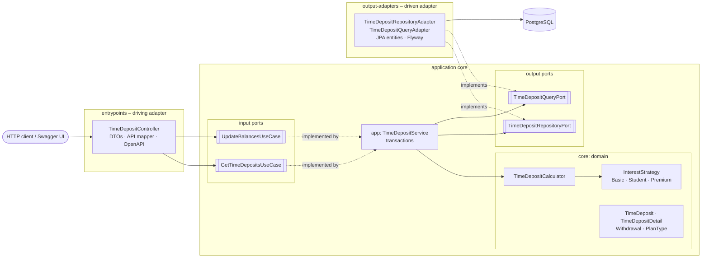
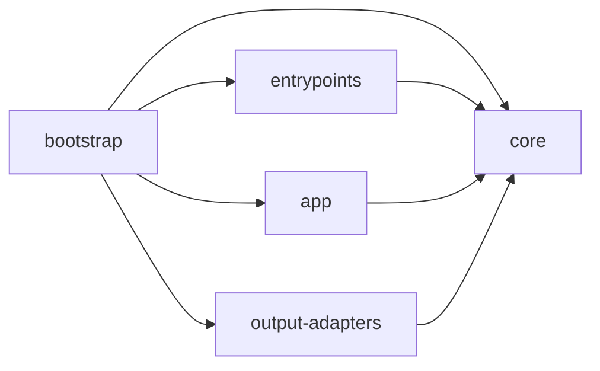
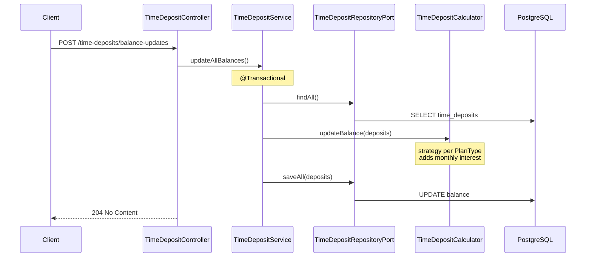
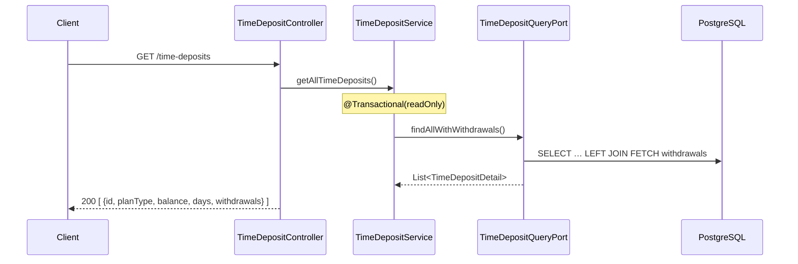
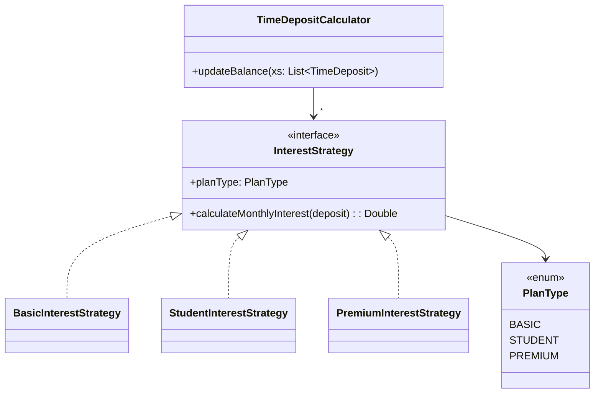
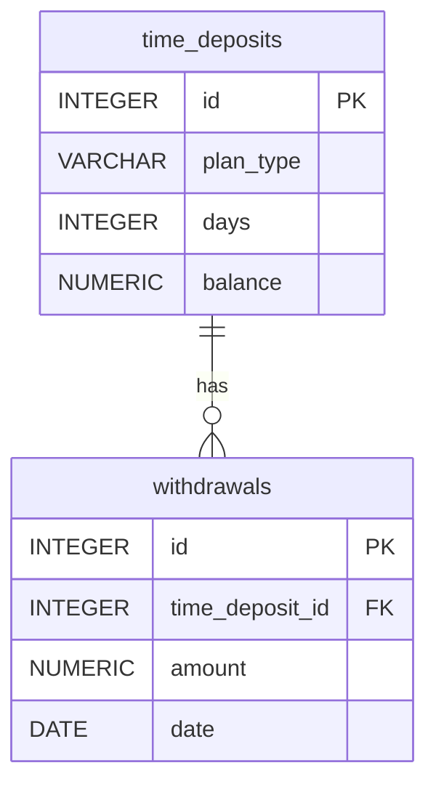

# Architecture

The service follows **Hexagonal Architecture (Ports & Adapters)**. Business logic sits in the
middle and knows nothing about HTTP or the database; everything technical plugs in from the outside.

## Hexagon

## Modules and dependency rule

| Module | Contains | Depends on |
|---|---|---|
| `core` | `TimeDeposit`, `TimeDepositCalculator`, interest strategies, domain model, use case interfaces (input ports), repository ports (output ports) | nothing (plain Kotlin) |
| `app` | `TimeDepositService` – implements the use cases, owns transactions | `core` |
| `entrypoints` | REST controller, response DTOs, API mapper, OpenAPI annotations | `core` |
| `output-adapters` | JPA entities and repositories, port implementations, Flyway migrations | `core` |
| `bootstrap` | Spring Boot application, configuration, end-to-end tests | all |

Rules:
- `core` has no framework dependencies, so business rules are testable with plain unit tests.
- Adapters never depend on each other; they only meet in `bootstrap`.
- Gradle modules enforce the rule at compile time – a wrong import does not compile.

## Request flows

### `POST /time-deposits/balance-updates`

### `GET /time-deposits`

## Interest calculation – Strategy pattern

| Plan | Annual rate (1/12 per update) | Eligible when |
|---|---|---|
| basic | 1 % | `days > 30` |
| student | 3 % | `31 <= days <= 365` |
| premium | 5 % | `days > 45` |

- Each strategy owns its eligibility rules and rounding, so rules can change per plan independently.
- **Open/Closed:** a new plan = new `PlanType` value + new strategy; the calculator does not change.
- Strategies are injected through the calculator's constructor with a default list, so the public
  `updateBalance(List<TimeDeposit>)` signature and all existing callers stay unchanged.
- Unknown plan types get no interest, exactly like the legacy code.

## Persistence

- Schema is owned by Flyway (`V1__create_time_deposits_and_withdrawals.sql`); Hibernate only validates (`ddl-auto: validate`).
- Table and column names are snake_case (PostgreSQL convention) for the assignment's `timeDeposits` / `timeDepositId`.
- No `CHECK` constraint on `plan_type`, so adding a plan needs no migration.

## Key decisions

| Decision | Why |
|---|---|
| Calculator keeps `Double` | Switching to `BigDecimal` would change rounding; the assignment says behaviour must stay identical. Characterization tests guard it. |
| `BigDecimal` everywhere else | Money in DB (`NUMERIC(19,2)`) and API; the adapter converts at the boundary. |
| Separate write port and query port | Write side works with `TimeDeposit` (what the calculator needs); read side returns `TimeDepositDetail` with withdrawals. Each stays simple. |
| Unidirectional `@OneToMany` for withdrawals, no cascade | Withdrawals are read-only history; the domain `Withdrawal` has no back-reference. |
| Fetch-join for GET | Loads deposits and withdrawals in one query (no N+1). |
| `days` not incremented by the update | Assumed to be maintained by another system (see `UpdateBalancesUseCase` KDoc). |
| Code-first OpenAPI (springdoc) | Contract is generated from the controller annotations and served at `/v3/api-docs`, so it cannot drift from the code. |
| Testcontainers PostgreSQL in tests | Tests run against the same database engine as production. |
